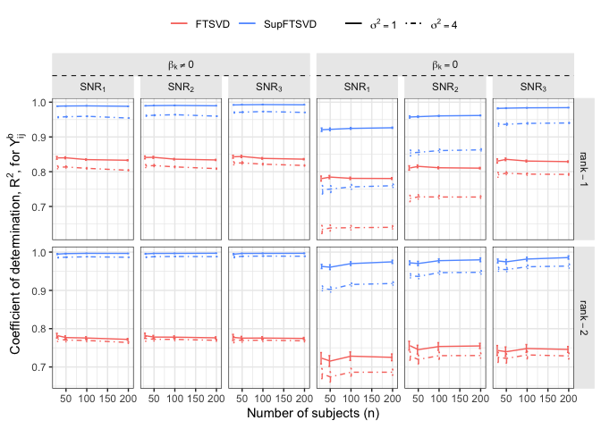
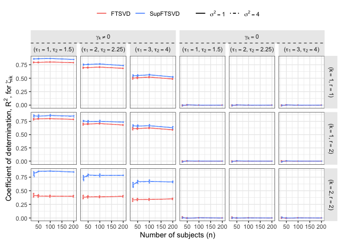
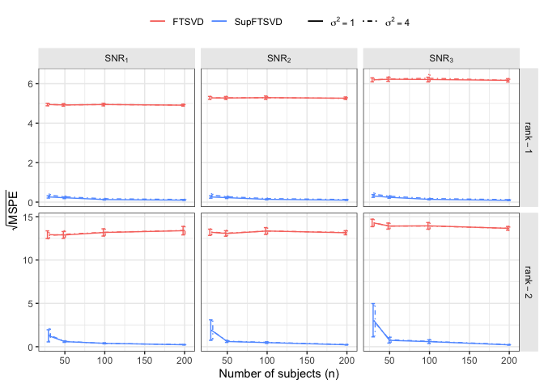
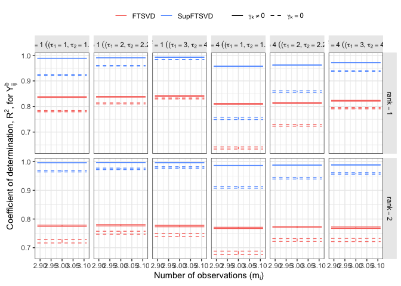
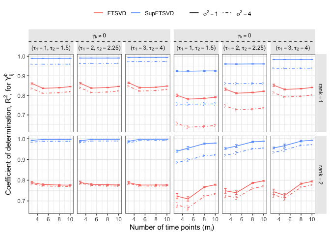
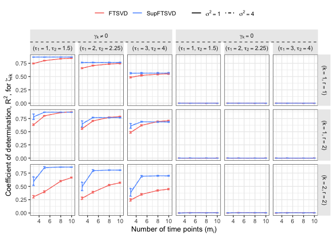
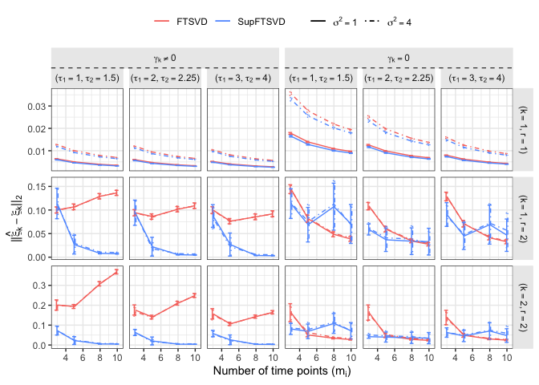
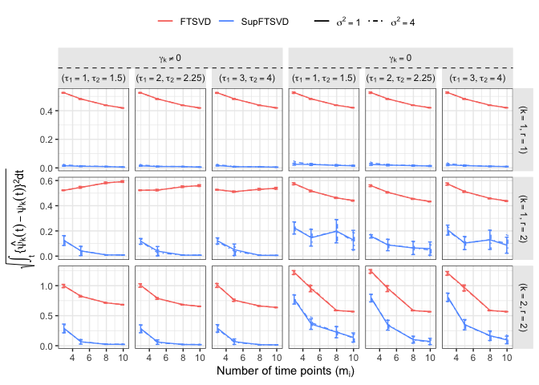
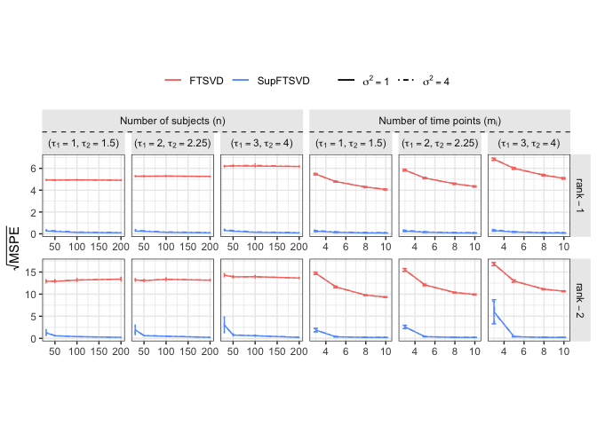

# SupFTSVD: a dimension reduction approach


<script src="README_files/libs/kePrint-0.0.1/kePrint.js"></script>
<link href="README_files/libs/lightable-0.0.1/lightable.css" rel="stylesheet" />


# Introduction

Alam (2024+) proposed SupFTSVD as a supervised low-rank approximation of
high-dimensional multivariate functional data via tensor decomposition.
This repository highlights results of the simulation study.

``` r
library(tidyverse)
library(dplyr)
library(gridExtra)
library(ggplot2)
library(factoextra)
library(glmnet)
library(rsvd)
library(ggpubr)
library(matrixcalc)
library(ggh4x)
source(paste(getwd(),'/SimulationStudy_RCodes/FTSVD.R',sep = ""))
```

# Trend over sample size

``` r
dirP<-paste(getwd(),"/SimulationStudy_Results/",sep="")
dirP<-"/Users/ma521/Academic/PHD_RESEARCH/SupFTSVD_Paper/SimulationStudy_Results/SupFTSVD/"
fname<-list.files(dirP)
mbar<-c(3,5,8)
```

``` r
Res2g3<-read.csv(paste(dirP,fname[5],sep = ""))
Res3g3<-read.csv(paste(dirP,fname[6],sep = ""))
Res2g3us<-read.csv(paste(dirP,fname[13],sep = ""))
Res3g3us<-read.csv(paste(dirP,fname[14],sep = ""))
```

``` r
#ifelse(Sig2E==1,"paste(SNR[1])",ifelse(Sig2E==2,"paste(SNR[2])","paste(SNR[3])"))
Res2_dat<-Res2g3 %>%
  mutate(SNR=factor(ifelse(Sig2E==1,"paste(SNR[1])",ifelse(Sig2E==2,"paste(SNR[2])","paste(SNR[3])")),labels=c(expression("("*list(tau[1]==1,tau[2]==1.5)*")"),
                             expression("("*list(tau[1]==2,tau[2]==2.25)*")"),
                             expression("("*list(tau[1]==3,tau[2]==4)*")"))),
         xiFTSVD1=sqrt(xiFTSVD1),
         xiSupFTSVD1=sqrt(xiSupFTSVD1)) %>%
  dplyr::select(Tau,n,comp,Grid,SNR,Tau,FTSVD1MP,bFTSVD1,xiFTSVD1,SupFTSVD1CM,bSupFTSVD1,xiSupFTSVD1,FTSVD1,SupFTSVD1,Cov2R,SupCov2R,AR2_FTSVD1,AR2_SupFTSVD1) %>%
  set_names("Tau","n","Comp","Grid","SNR","a_FTSVD","b_FTSVD","c_FTSVD","a_SupFTSVD","b_SupFTSVD","c_SupFTSVD","d_FTSVD","d_SupFTSVD","e_FTSVD","e_SupFTSVD","f_FTSVD","f_SupFTSVD") %>%
  pivot_longer(cols = ends_with("FTSVD"),names_to = c("Var",".value"),
               names_sep = "_") %>% 
  pivot_longer(cols=c("FTSVD","SupFTSVD"),values_to = "FuncV",names_to = "Method") %>%
  mutate(SamT=factor(ifelse(Tau==1,"paste(sigma^2==1)","paste(sigma^2==4)"),
                   levels=c("paste(sigma^2==1)","paste(sigma^2==4)")),
         Model="1")
```

``` r
Res2_dat_us<-Res2g3us %>%
  mutate(SNR=factor(ifelse(Sig2E==1,"paste(SNR[1])",ifelse(Sig2E==2,"paste(SNR[2])","paste(SNR[3])")),labels=c(expression("("*list(tau[1]==1,tau[2]==1.5)*")"),
                             expression("("*list(tau[1]==2,tau[2]==2.25)*")"),
                             expression("("*list(tau[1]==3,tau[2]==4)*")"))),
         xiFTSVD1=sqrt(xiFTSVD1),
         xiSupFTSVD1=sqrt(xiSupFTSVD1)) %>%
  dplyr::select(Tau,n,comp,Grid,SNR,Tau,FTSVD1MP,bFTSVD1,xiFTSVD1,SupFTSVD1CM,bSupFTSVD1,xiSupFTSVD1,FTSVD1,SupFTSVD1,Cov2R,SupCov2R,AR2_FTSVD1,AR2_SupFTSVD1) %>%
  set_names("Tau","n","Comp","Grid","SNR","a_FTSVD","b_FTSVD","c_FTSVD","a_SupFTSVD","b_SupFTSVD","c_SupFTSVD","d_FTSVD","d_SupFTSVD","e_FTSVD","e_SupFTSVD","f_FTSVD","f_SupFTSVD") %>%
  pivot_longer(cols = ends_with("FTSVD"),names_to = c("Var",".value"),
               names_sep = "_") %>% 
  pivot_longer(cols=c("FTSVD","SupFTSVD"),values_to = "FuncV",names_to = "Method") %>%
  mutate(SamT=factor(ifelse(Tau==1,"paste(sigma^2==1)","paste(sigma^2==4)"),
                   levels=c("paste(sigma^2==1)","paste(sigma^2==4)")),
         Model="1")
```

``` r
Res3_dat<-Res3g3 %>%
  mutate(SNR=ifelse(Sig2E==1|Sig2E==1.5,1,ifelse(Sig2E==2|Sig2E==2.25,2,3))) %>%
  mutate(xiFTSVD1=sqrt(xiFTSVD1),
         xiSupFTSVD1=sqrt(xiSupFTSVD1)) %>%
  dplyr::select(Tau,n,comp,Grid,SNR,Tau,FTSVD1MP,bFTSVD1,xiFTSVD1,SupFTSVD1CM,bSupFTSVD1,xiSupFTSVD1,FTSVD1,SupFTSVD1,Cov2R,SupCov2R,AR2_FTSVD1,AR2_SupFTSVD1) %>%
  set_names("Tau","n","Comp","Grid","SNR","a_FTSVD","b_FTSVD","c_FTSVD","a_SupFTSVD","b_SupFTSVD","c_SupFTSVD","d_FTSVD","d_SupFTSVD","e_FTSVD","e_SupFTSVD","f_FTSVD","f_SupFTSVD") %>%
  pivot_longer(cols = ends_with("FTSVD"),names_to = c("Var",".value"),
               names_sep = "_") %>%
  pivot_longer(c("FTSVD","SupFTSVD"),names_to = "Method",values_to = "FuncV") %>%
  mutate(SNR=factor(recode(SNR,
                    "1"="paste(SNR[1])",
                    "2"="paste(SNR[2])",
                    "3"="paste(SNR[3])"),
                    labels=c(expression("("*list(tau[1]==1,tau[2]==1.5)*")"),
                             expression("("*list(tau[1]==2,tau[2]==2.25)*")"),
                             expression("("*list(tau[1]==3,tau[2]==4)*")"))),
         SamT=factor(ifelse(Tau==1,"paste(sigma^2==1)","paste(sigma^2==4)"),levels=c("paste(sigma^2==1)","paste(sigma^2==4)")),
         Model="2")
```

``` r
Res3_dat_us<-Res3g3us %>%
  mutate(SNR=ifelse(Sig2E==1|Sig2E==1.5,1,ifelse(Sig2E==2|Sig2E==2.25,2,3))) %>%
  mutate(xiFTSVD1=sqrt(xiFTSVD1),
         xiSupFTSVD1=sqrt(xiSupFTSVD1)) %>%
  dplyr::select(Tau,n,comp,Grid,SNR,Tau,FTSVD1MP,bFTSVD1,xiFTSVD1,SupFTSVD1CM,bSupFTSVD1,xiSupFTSVD1,FTSVD1,SupFTSVD1,Cov2R,SupCov2R,AR2_FTSVD1,AR2_SupFTSVD1) %>%
  set_names("Tau","n","Comp","Grid","SNR","a_FTSVD","b_FTSVD","c_FTSVD","a_SupFTSVD","b_SupFTSVD","c_SupFTSVD","d_FTSVD","d_SupFTSVD","e_FTSVD","e_SupFTSVD","f_FTSVD","f_SupFTSVD") %>%
  pivot_longer(cols = ends_with("FTSVD"),names_to = c("Var",".value"),
               names_sep = "_") %>%
  pivot_longer(c("FTSVD","SupFTSVD"),names_to = "Method",values_to = "FuncV") %>%
  mutate(SNR=factor(recode(SNR,
                    "1"="paste(SNR[1])",
                    "2"="paste(SNR[2])",
                    "3"="paste(SNR[3])"),
                    labels=c(expression("("*list(tau[1]==1,tau[2]==1.5)*")"),
                             expression("("*list(tau[1]==2,tau[2]==2.25)*")"),
                             expression("("*list(tau[1]==3,tau[2]==4)*")"))),
         SamT=factor(ifelse(Tau==1,"paste(sigma^2==1)","paste(sigma^2==4)"),levels=c("paste(sigma^2==1)","paste(sigma^2==4)")),
         Model="2")
```

## Figure 1 ($R^2$ for data model)

``` r
Res2_dat %>%
  add_case(Res3_dat) %>%
  add_case(Res2_dat_us) %>%
  add_case(Res3_dat_us) %>%
  mutate(Scenario=rep(c("Sup","USup"),c(nrow(Res2_dat)+nrow(Res3_dat),nrow(Res2_dat_us)+nrow(Res3_dat_us)))) %>%
  group_by(Tau,n,Comp,Method,Model,SNR,Var,Scenario) %>%
  mutate(Iter=row_number()) %>%
  ungroup() %>%
  mutate(ModelCompTau=paste("paste(sigma^2==",Tau,"~","(list(k==",Comp,",r==",Model,")))",sep=""))%>%
  mutate(ModelTau=factor(paste("paste(sigma^2==",Tau,"~","(r==",Model,"))",sep=""),labels = c("paste(sigma^2==1(r==1))","paste(sigma^2==4(r==1))","paste(sigma^2==1(r==2))","paste(sigma^2==4(r==2))")))%>%
  mutate(ModelComp=factor(ifelse(Model=="1" & Comp=="1","paste(list(k==1,r==1))",
                                 ifelse(Model=="2" & Comp=="1","paste(list(k==1,r==2))","paste(list(k==2,r==2))")),labels = c(expression("("*list(k==1,r==1)*")"), expression("("*list(k==1,r==2)*")"),expression("("*list(k==2,r==2)*")")))) %>%
  mutate(TauSNR=paste("paste(sigma^2==",Tau,"~","(",SNR,"))",sep="")) %>%
  filter(Var=="f") %>%
  filter(!(Model==2 & Comp==1)) %>%
  mutate(Model=recode(Model,
                      "1"="rank-1",
                      "2"="rank-2")) %>%
  group_by(Model,Tau,SNR,n,Scenario,Method) %>%
  summarise_if(is.numeric,c("mean","sd","length")) %>%
  mutate(Scenario=ifelse(Scenario=="Sup","paste(bold(gamma)[k]!=0)","paste(bold(gamma)[k]==0)")) %>%
  ggplot(aes(x=n,y=FuncV_mean,group=interaction(Method,Tau),color=Method)) +
  geom_line(aes(linetype=as.factor(Tau))) +
  geom_errorbar(aes(ymin=FuncV_mean-2*(FuncV_sd/sqrt(FuncV_length)),ymax=FuncV_mean+2*(FuncV_sd/sqrt(FuncV_length)),linetype=as.factor(Tau)),
                position=position_dodge(5)) +
  facet_nested(Model~Scenario+SNR,scales = "free_y",labeller = label_parsed,nest_line = element_line(linetype = 2)) + 
  #facet_grid(rows = vars(Model),cols = vars(Scenario,SNR),scales = "free_y",labeller = label_parsed)+
  xlab(expression("Number of subjects (n)")) +
  ylab(expression("Coefficient of determination, "*R^2*", for "*Y[ij]^b)) +
  theme(legend.title = element_blank(),
        legend.position = "top",
        legend.background = element_rect(fill = "transparent",linetype = 0),
        legend.direction = "horizontal",
        legend.box = "horizontal",
        panel.background = element_rect(fill = "white",colour = NA), 
        panel.border = element_rect(fill = NA, colour = "grey20"), 
        panel.grid = element_line(colour = "grey92"), 
        panel.grid.minor = element_line(linewidth = rel(0.5)), 
        strip.background = element_rect(fill = "grey92", 
                                        colour = "grey92"), complete = TRUE)+
  scale_color_manual(values=c("#F8766D","#619CFF")) +
  scale_linetype_manual(values=c(1,4),labels=c(expression(sigma^2==1),expression(sigma^2==4)))
```



``` r
ggsave(filename = "r12susp_errbr_r2tensor_v1.pdf",height = 5,width=12,unit="in")
```

## Figure 2 ($R^2$ for subject loading model)

``` r
Res2_dat %>%
  add_case(Res3_dat) %>%
  add_case(Res2_dat_us) %>%
  add_case(Res3_dat_us) %>%
  mutate(Scenario=rep(c("Sup","USup"),c(nrow(Res2_dat)+nrow(Res3_dat),nrow(Res2_dat_us)+nrow(Res3_dat_us)))) %>%
  group_by(Tau,n,Comp,Method,Model,SNR,Var,Scenario) %>%
  mutate(Iter=row_number()) %>%
  ungroup() %>%
  mutate(ModelCompTau=paste("paste(sigma^2==",Tau,"~","(list(k==",Comp,",r==",Model,")))",sep=""))%>%
  mutate(ModelComp=factor(ifelse(Model=="1" & Comp=="1","paste(list(k==1,r==1))",
                         ifelse(Model=="2" & Comp=="1","paste(list(k==1,r==2))","paste(list(k==2,r==2))")),labels = c(expression("("*list(k==1,r==1)*")"), expression("("*list(k==1,r==2)*")"),expression("("*list(k==2,r==2)*")")))) %>%
  mutate(TauSNR=paste("paste(sigma^2==",Tau,"~","(",SNR,"))",sep="")) %>%
  filter(Var=="e") %>%
  group_by(ModelComp,Tau,SNR,n,Scenario,Method) %>%
  summarise_if(is.numeric,c("mean","sd","length")) %>%
  mutate(Scenario=ifelse(Scenario=="Sup","paste(bold(gamma)[k]!=0)","paste(bold(gamma)[k]==0)")) %>%
  ggplot(aes(x=n,y=FuncV_mean,group=interaction(Method,Tau),color=Method)) +
  geom_line(aes(linetype=as.factor(Tau))) +
  geom_errorbar(aes(ymin=FuncV_mean-2*(FuncV_sd/sqrt(FuncV_length)),ymax=FuncV_mean+2*(FuncV_sd/sqrt(FuncV_length)),linetype=as.factor(Tau)),
                position=position_dodge(5)) +
  facet_nested(ModelComp~Scenario+SNR,scales = "free_y",labeller = label_parsed,nest_line = element_line(linetype = 2)) + 
  xlab(expression("Number of subjects (n)")) +
  ylab(expression("Coefficient of determination, "*R^2*", for "*zeta[ik])) +
  theme(legend.title = element_blank(),
        legend.position = "top",
        legend.background = element_rect(fill = "transparent",linetype = 0),
        legend.direction = "horizontal",
        legend.box = "horizontal",
        panel.background = element_rect(fill = "white",colour = NA), 
        panel.border = element_rect(fill = NA, colour = "grey20"), 
        panel.grid = element_line(colour = "grey92"), 
        panel.grid.minor = element_line(linewidth = rel(0.5)), 
        strip.background = element_rect(fill = "grey92", 
                                        colour = "grey92"), complete = TRUE)+
  scale_color_manual(values=c("#F8766D","#619CFF")) +
  scale_linetype_manual(values=c(1,4),labels=c(expression(sigma^2==1),expression(sigma^2==4)))
```



``` r
ggsave(filename = "r12susp_errbr_r2zeta_v1.pdf",height = 6,width=12,unit="in")
```

## Prediction error over sample size, $n$

``` r
dirP<-"/Users/ma521/Academic/PHD_RESEARCH/SupFTSVD_Paper/SimulationStudy_Results/SupFTSVD/"
fname<-list.files(dirP)
mbar<-c(3,5,8)
Res2g3<-read.csv(paste(dirP,fname[9],sep = ""))
Res3g3<-read.csv(paste(dirP,fname[10],sep = ""))
```

``` r
pred_n<-Res3g3 %>%
  add_case(Res2g3) %>%
  mutate(SNR=factor(ifelse(Sig2E1==1,"paste(SNR[1])",ifelse(Sig2E1==2,"paste(SNR[2])","paste(SNR[3])")),labels=c(expression("("*list(tau[1]==1,tau[2]==1.5)*")"),
                             expression("("*list(tau[1]==2,tau[2]==2.25)*")"),
                             expression("("*list(tau[1]==3,tau[2]==4)*")"))),
         Model=rep(c("rank-2","rank-1"),c(nrow(Res3g3),nrow(Res2g3)))) %>%
  dplyr::select(Model,Tau,n,SNR,TftsvdTR,TsubTR) %>%
  set_names("Model","Tau","n","SNR","FTSVD","SupFTSVD") %>%
  pivot_longer(c("FTSVD","SupFTSVD"),names_to = "Method",values_to = "FuncV") %>%
  group_by(Model,Tau,n,SNR,Method) %>%
      summarise_if(is.numeric,c("mean","sd","length")) %>%
  set_names("Model","Tau","n","SNR","Method","FuncV_mean","FuncV_sd","FuncV_length") %>%
    mutate(Type="paste('Number of subjects ('*n*')')") %>%
      ungroup()
```

``` r
se_dat<-Res3g3 %>%
  add_case(Res2g3) %>%
  mutate(SNR=ifelse(Sig2E1==1,"$SNR_1$",ifelse(Sig2E1==2,"$SNR_2$","$SNR_3$")),
         Model=rep(c("rank-1","rank-2"),c(nrow(Res3g3),nrow(Res2g3)))) %>%
  dplyr::select(Model,Tau,n,SNR,TftsvdTR,TsubTR) %>%
  set_names("Model","Tau","n","SNR","FTSVD","SupFTSVD") %>%
  pivot_longer(c("FTSVD","SupFTSVD"),names_to = "Method",values_to = "FuncV") %>%
  group_by(Model,Tau,n,SNR,Method) %>%
  summarise_all(c("sd","length")) %>%
  mutate(SEval=sd/sqrt(length)) %>%
  ungroup() %>%
  pivot_wider(id_cols = c("SNR","n","Model","Tau"),
              names_from = c("Method"),
              values_from = c("SEval"))
```

``` r
Res3g3 %>%
  add_case(Res2g3) %>%
  mutate(SNR=ifelse(Sig2E1==1,"paste(SNR[1])",ifelse(Sig2E1==2,"paste(SNR[2])","paste(SNR[3])")),
         Model=rep(c("rank-2","rank-1"),c(nrow(Res3g3),nrow(Res2g3)))) %>%
  dplyr::select(Model,Tau,n,SNR,TftsvdTR,TsubTR) %>%
  set_names("Model","Tau","n","SNR","FTSVD","SupFTSVD") %>%
  pivot_longer(c("FTSVD","SupFTSVD"),names_to = "Method",values_to = "FuncV") %>%
  group_by(Model,Tau,n,SNR,Method) %>%
      summarise_if(is.numeric,c("mean","sd","length")) %>%
  set_names("Model","Tau","n","SNR","Method","FuncV_mean","FuncV_sd","FuncV_length") %>%
  ggplot(aes(x=n,y=FuncV_mean,group=interaction(Method,Tau),color=Method)) +
  geom_line(aes(linetype=as.factor(Tau))) +
  geom_errorbar(aes(ymin=FuncV_mean-2*(FuncV_sd/sqrt(FuncV_length)),ymax=FuncV_mean+2*(FuncV_sd/sqrt(FuncV_length)),linetype=as.factor(Tau)),
                position=position_dodge(5)) +
  facet_grid(rows=vars(Model),cols=vars(SNR),scales = "free_y",labeller = label_parsed) + 
  xlab(expression("Number of subjects (n)")) +
  ylab(expression(sqrt(MSPE))) +
  theme(legend.title = element_blank(),
        legend.position = "top",
        legend.background = element_rect(fill = "transparent",linetype = 0),
        legend.direction = "horizontal",
        legend.box = "horizontal",
        panel.background = element_rect(fill = "white",colour = NA), 
        panel.border = element_rect(fill = NA, colour = "grey20"), 
        panel.grid = element_line(colour = "grey92"), 
        panel.grid.minor = element_line(linewidth = rel(0.5)), 
        strip.background = element_rect(fill = "grey92", 
                                        colour = "grey92"), complete = TRUE)+
  scale_color_manual(values=c("#F8766D","#619CFF")) +
  scale_linetype_manual(values=c(1,4),labels=c(expression(sigma^2==1),expression(sigma^2==4)))
```



<!-- ## Figure S1: $X\beta$ -->

## Figure $S1$ ($\boldsymbol{\xi}_k$)

``` r
Res2_dat %>%
  add_case(Res3_dat) %>%
  add_case(Res2_dat_us) %>%
  add_case(Res3_dat_us) %>%
  mutate(Scenario=rep(c("Sup","USup"),c(nrow(Res2_dat)+nrow(Res3_dat),nrow(Res2_dat_us)+nrow(Res3_dat_us)))) %>%
  group_by(Tau,n,Comp,Method,Model,SNR,Var,Scenario) %>%
  mutate(Iter=row_number()) %>%
  ungroup() %>%
  mutate(ModelCompTau=paste("paste(sigma^2==",Tau,"~","(list(k==",Comp,",r==",Model,")))",sep=""))%>%
  mutate(ModelComp=factor(ifelse(Model=="1" & Comp=="1","paste(list(k==1,r==1))",
                         ifelse(Model=="2" & Comp=="1","paste(list(k==1,r==2))","paste(list(k==2,r==2))")),labels = c(expression("("*list(k==1,r==1)*")"), expression("("*list(k==1,r==2)*")"),expression("("*list(k==2,r==2)*")")))) %>%
  mutate(TauSNR=paste("paste(sigma^2==",Tau,"~",SNR,")",sep="")) %>%
  filter(Var=="b") %>%
  group_by(ModelComp,Tau,SNR,n,Scenario,Method) %>%
  summarise_if(is.numeric,c("mean","sd","length")) %>%
  mutate(Scenario=ifelse(Scenario=="Sup","paste(bold(gamma)[k]!=0)","paste(bold(gamma)[k]==0)")) %>%
  ggplot(aes(x=n,y=FuncV_mean,group=interaction(Method,Tau),color=Method)) +
  geom_line(aes(linetype=as.factor(Tau))) +
  geom_errorbar(aes(ymin=FuncV_mean-2*(FuncV_sd/sqrt(FuncV_length)),ymax=FuncV_mean+2*(FuncV_sd/sqrt(FuncV_length)),linetype=as.factor(Tau)),
                position=position_dodge(5)) +
  facet_nested(ModelComp~Scenario+SNR,scales = "free_y",labeller = label_parsed,nest_line = element_line(linetype = 2)) + 
  #facet_grid(rows = vars(ModelComp),cols = vars(TauSNR),scales = "free_y",labeller = label_parsed)+
  xlab(expression("Number of subjects (n)")) +
  ylab(expression("||"*hat(bold(xi))[k]-bold(xi)[k]*"||"[2])) +
  theme(legend.title = element_blank(),
        legend.position = "top",legend.background = element_rect(fill = "transparent",linetype = 0),legend.direction = "horizontal",legend.box = "horizontal",
        panel.background = element_rect(fill = "white",colour = NA), 
        panel.border = element_rect(fill = NA, colour = "grey20"), 
        panel.grid = element_line(colour = "grey92"), 
        panel.grid.minor = element_line(linewidth = rel(0.5)), 
        strip.background = element_rect(fill = "grey92", 
                                        colour = "grey92"), complete = TRUE)+
  scale_color_manual(values=c("#F8766D","#619CFF")) +
  scale_linetype_manual(values=c(1,4),labels=c(expression(sigma^2==1),expression(sigma^2==4)))  
```



``` r
ggsave(filename = "r12susp_errbr_xi.pdf",height = 6,width=12,unit="in")
```

## Figure $S3$ $\psi_k(\cdot)$

``` r
Res2_dat %>%
  add_case(Res3_dat) %>%
  add_case(Res2_dat_us) %>%
  add_case(Res3_dat_us) %>%
  mutate(Scenario=rep(c("Sup","USup"),c(nrow(Res2_dat)+nrow(Res3_dat),nrow(Res2_dat_us)+nrow(Res3_dat_us)))) %>%
  group_by(Tau,n,Comp,Method,Model,SNR,Var,Scenario) %>%
  mutate(Iter=row_number()) %>%
  ungroup() %>%
  mutate(ModelCompTau=paste("paste(sigma^2==",Tau,"~","(list(k==",Comp,",r==",Model,")))",sep=""))%>%
  mutate(ModelComp=factor(ifelse(Model=="1" & Comp=="1","paste(list(k==1,r==1))",
                         ifelse(Model=="2" & Comp=="1","paste(list(k==1,r==2))","paste(list(k==2,r==2))")),labels = c(expression("("*list(k==1,r==1)*")"), expression("("*list(k==1,r==2)*")"),expression("("*list(k==2,r==2)*")")))) %>%
  mutate(TauSNR=paste("paste(sigma^2==",Tau,"~",SNR,")",sep="")) %>%
  filter(Var=="c") %>%
  group_by(ModelComp,Tau,SNR,n,Scenario,Method) %>%
  summarise_if(is.numeric,c("mean","sd","length")) %>%
  mutate(Scenario=ifelse(Scenario=="Sup","paste(bold(gamma)[k]!=0)","paste(bold(gamma)[k]==0)")) %>%
  ggplot(aes(x=n,y=FuncV_mean,group=interaction(Method,Tau),color=Method)) +
  geom_line(aes(linetype=as.factor(Tau))) +
  geom_errorbar(aes(ymin=FuncV_mean-2*(FuncV_sd/sqrt(FuncV_length)),ymax=FuncV_mean+2*(FuncV_sd/sqrt(FuncV_length)),linetype=as.factor(Tau)),
                position=position_dodge(5)) +
  facet_nested(ModelComp~Scenario+SNR,scales = "free_y",labeller = label_parsed,nest_line = element_line(linetype = 2)) + 
  #facet_grid(rows = vars(ModelComp),cols = vars(TauSNR),scales = "free_y",labeller = label_parsed)+
  xlab(expression("Number of subjects (n)")) +
  ylab(expression(sqrt(integral("{"*hat(psi[k])(t)-psi[k](t)*"}"^2*dt,t,"")))) +
  theme(legend.title = element_blank(),
        legend.position = "top",legend.background = element_rect(fill = "transparent",linetype = 0),legend.direction = "horizontal",legend.box = "horizontal",
        panel.background = element_rect(fill = "white",colour = NA), 
        panel.border = element_rect(fill = NA, colour = "grey20"), 
        panel.grid = element_line(colour = "grey92"), 
        panel.grid.minor = element_line(linewidth = rel(0.5)), 
        strip.background = element_rect(fill = "grey92", 
                                        colour = "grey92"), complete = TRUE)+
  scale_color_manual(values=c("#F8766D","#619CFF")) +
  scale_linetype_manual(values=c(1,4),labels=c(expression(sigma^2==1),expression(sigma^2==4)))  
```


``` r
ggsave(filename = "r12susp_errbr_psi.pdf",height = 6,width=12,unit="in")
```

# Trend over grid density

``` r
Res2g3<-read.csv(paste(dirP,fname[3],sep = ""))
Res3g3<-read.csv(paste(dirP,fname[4],sep = ""))
Res2g3us<-read.csv(paste(dirP,fname[11],sep = ""))
Res3g3us<-read.csv(paste(dirP,fname[12],sep = ""))
```

``` r
Res2_dat<-Res2g3 %>%
  mutate(SNR=factor(ifelse(Sig2E==1,"paste(SNR[1])",ifelse(Sig2E==2,"paste(SNR[2])","paste(SNR[3])")),labels=c(expression("("*list(tau[1]==1,tau[2]==1.5)*")"),
                             expression("("*list(tau[1]==2,tau[2]==2.25)*")"),
                             expression("("*list(tau[1]==3,tau[2]==4)*")"))),
         xiFTSVD1=sqrt(xiFTSVD1),
         xiSupFTSVD1=sqrt(xiSupFTSVD1)) %>%
  dplyr::select(Tau,n,comp,Grid,SNR,Tau,FTSVD1MP,bFTSVD1,xiFTSVD1,SupFTSVD1CM,bSupFTSVD1,xiSupFTSVD1,FTSVD1,SupFTSVD1,Cov2R,SupCov2R,AR2_FTSVD1,AR2_SupFTSVD1) %>%
  set_names("Tau","n","Comp","Grid","SNR","a_FTSVD","b_FTSVD","c_FTSVD","a_SupFTSVD","b_SupFTSVD","c_SupFTSVD","d_FTSVD","d_SupFTSVD","e_FTSVD","e_SupFTSVD","f_FTSVD","f_SupFTSVD") %>%
  pivot_longer(cols = ends_with("FTSVD"),names_to = c("Var",".value"),
               names_sep = "_") %>% 
  pivot_longer(cols=c("FTSVD","SupFTSVD"),values_to = "FuncV",names_to = "Method") %>%
  mutate(SamT=factor(ifelse(Tau==1,"paste(sigma^2==1)","paste(sigma^2==4)"),
                   levels=c("paste(sigma^2==1)","paste(sigma^2==4)")),
         Model="1")
```

``` r
Res2_dat_us<-Res2g3us %>%
  mutate(SNR=factor(ifelse(Sig2E==1,"paste(SNR[1])",ifelse(Sig2E==2,"paste(SNR[2])","paste(SNR[3])")),labels=c(expression("("*list(tau[1]==1,tau[2]==1.5)*")"),
                             expression("("*list(tau[1]==2,tau[2]==2.25)*")"),
                             expression("("*list(tau[1]==3,tau[2]==4)*")"))),
         xiFTSVD1=sqrt(xiFTSVD1),
         xiSupFTSVD1=sqrt(xiSupFTSVD1)) %>%
  dplyr::select(Tau,n,comp,Grid,SNR,Tau,FTSVD1MP,bFTSVD1,xiFTSVD1,SupFTSVD1CM,bSupFTSVD1,xiSupFTSVD1,FTSVD1,SupFTSVD1,Cov2R,SupCov2R,AR2_FTSVD1,AR2_SupFTSVD1) %>%
  set_names("Tau","n","Comp","Grid","SNR","a_FTSVD","b_FTSVD","c_FTSVD","a_SupFTSVD","b_SupFTSVD","c_SupFTSVD","d_FTSVD","d_SupFTSVD","e_FTSVD","e_SupFTSVD","f_FTSVD","f_SupFTSVD") %>%
  pivot_longer(cols = ends_with("FTSVD"),names_to = c("Var",".value"),
               names_sep = "_") %>% 
  pivot_longer(cols=c("FTSVD","SupFTSVD"),values_to = "FuncV",names_to = "Method") %>%
  mutate(SamT=factor(ifelse(Tau==1,"paste(sigma^2==1)","paste(sigma^2==4)"),
                   levels=c("paste(sigma^2==1)","paste(sigma^2==4)")),
         Model="1")
```

``` r
Res3_dat<-Res3g3 %>%
  mutate(SNR=ifelse(Sig2E==1|Sig2E==1.5,1,ifelse(Sig2E==2|Sig2E==2.25,2,3))) %>%
  mutate(xiFTSVD1=sqrt(xiFTSVD1),
         xiSupFTSVD1=sqrt(xiSupFTSVD1)) %>%
  dplyr::select(Tau,n,comp,Grid,SNR,Tau,FTSVD1MP,bFTSVD1,xiFTSVD1,SupFTSVD1CM,bSupFTSVD1,xiSupFTSVD1,FTSVD1,SupFTSVD1,Cov2R,SupCov2R,AR2_FTSVD1,AR2_SupFTSVD1) %>%
  set_names("Tau","n","Comp","Grid","SNR","a_FTSVD","b_FTSVD","c_FTSVD","a_SupFTSVD","b_SupFTSVD","c_SupFTSVD","d_FTSVD","d_SupFTSVD","e_FTSVD","e_SupFTSVD","f_FTSVD","f_SupFTSVD") %>%
  pivot_longer(cols = ends_with("FTSVD"),names_to = c("Var",".value"),
               names_sep = "_") %>%
  pivot_longer(c("FTSVD","SupFTSVD"),names_to = "Method",values_to = "FuncV") %>%
  mutate(SNR=factor(recode(SNR,
                    "1"="paste(SNR[1])",
                    "2"="paste(SNR[2])",
                    "3"="paste(SNR[3])"),labels=c(expression("("*list(tau[1]==1,tau[2]==1.5)*")"),
                             expression("("*list(tau[1]==2,tau[2]==2.25)*")"),
                             expression("("*list(tau[1]==3,tau[2]==4)*")"))),
         SamT=factor(ifelse(Tau==1,"paste(sigma^2==1)","paste(sigma^2==4)"),levels=c("paste(sigma^2==1)","paste(sigma^2==4)")),
         Model="2")
```

``` r
Res3_dat_us<-Res3g3us %>%
  mutate(SNR=ifelse(Sig2E==1|Sig2E==1.5,1,ifelse(Sig2E==2|Sig2E==2.25,2,3))) %>%
  mutate(xiFTSVD1=sqrt(xiFTSVD1),
         xiSupFTSVD1=sqrt(xiSupFTSVD1)) %>%
  dplyr::select(Tau,n,comp,Grid,SNR,Tau,FTSVD1MP,bFTSVD1,xiFTSVD1,SupFTSVD1CM,bSupFTSVD1,xiSupFTSVD1,FTSVD1,SupFTSVD1,Cov2R,SupCov2R,AR2_FTSVD1,AR2_SupFTSVD1) %>%
  set_names("Tau","n","Comp","Grid","SNR","a_FTSVD","b_FTSVD","c_FTSVD","a_SupFTSVD","b_SupFTSVD","c_SupFTSVD","d_FTSVD","d_SupFTSVD","e_FTSVD","e_SupFTSVD","f_FTSVD","f_SupFTSVD") %>%
  pivot_longer(cols = ends_with("FTSVD"),names_to = c("Var",".value"),
               names_sep = "_") %>%
  pivot_longer(c("FTSVD","SupFTSVD"),names_to = "Method",values_to = "FuncV") %>%
  mutate(SNR=factor(recode(SNR,
                    "1"="paste(SNR[1])",
                    "2"="paste(SNR[2])",
                    "3"="paste(SNR[3])"),labels=c(expression("("*list(tau[1]==1,tau[2]==1.5)*")"),
                             expression("("*list(tau[1]==2,tau[2]==2.25)*")"),
                             expression("("*list(tau[1]==3,tau[2]==4)*")"))),
         SamT=factor(ifelse(Tau==1,"paste(sigma^2==1)","paste(sigma^2==4)"),levels=c("paste(sigma^2==1)","paste(sigma^2==4)")),
         Model="2")
```

## Figure 3 ($R^2$ for data model)

``` r
Res2_dat %>%
  add_case(Res3_dat) %>%
  add_case(Res2_dat_us) %>%
  add_case(Res3_dat_us) %>%
  mutate(Scenario=rep(c("Sup","USup"),c(nrow(Res2_dat)+nrow(Res3_dat),nrow(Res2_dat_us)+nrow(Res3_dat_us)))) %>%
  group_by(Tau,Grid,Comp,Method,Model,SNR,Var,Scenario) %>%
  mutate(Iter=row_number()) %>%
  ungroup() %>%
  mutate(ModelCompTau=paste("paste(sigma^2==",Tau,"~","(list(k==",Comp,",r==",Model,")))",sep=""))%>%
  mutate(ModelTau=factor(paste("paste(sigma^2==",Tau,"~","(r==",Model,"))",sep=""),labels = c("paste(sigma^2==1(r==1))","paste(sigma^2==4(r==1))","paste(sigma^2==1(r==2))","paste(sigma^2==4(r==2))")))%>%
  mutate(ModelComp=factor(ifelse(Model=="1" & Comp=="1","paste(list(k==1,r==1))",
                         ifelse(Model=="2" & Comp=="1","paste(list(k==1,r==2))","paste(list(k==2,r==2))")),labels = c(expression("("*list(k==1,r==1)*")"), expression("("*list(k==1,r==2)*")"),expression("("*list(k==2,r==2)*")")))) %>%
  mutate(TauSNR=paste("paste(sigma^2==",Tau,"~",SNR,")",sep="")) %>%
  filter(Var=="f") %>%
  filter(!(Model==2 & Comp==1)) %>%
  mutate(Model=recode(Model,
                      "1"="rank-1",
                      "2"="rank-2")) %>%
  group_by(Model,Tau,SNR,Grid,Scenario,Method) %>%
  summarise_if(is.numeric,c("mean","sd","length")) %>%
  mutate(Scenario=ifelse(Scenario=="Sup","paste(bold(gamma)[k]!=0)","paste(bold(gamma)[k]==0)")) %>%
  ggplot(aes(x=Grid,y=FuncV_mean,group=interaction(Method,Tau),color=Method)) +
  geom_line(aes(linetype=as.factor(Tau))) +
  geom_errorbar(aes(ymin=FuncV_mean-2*(FuncV_sd/sqrt(FuncV_length)),ymax=FuncV_mean+2*(FuncV_sd/sqrt(FuncV_length)),linetype=as.factor(Tau)),
                position=position_dodge(0)) +
  facet_nested(Model~Scenario+SNR,scales = "free_y",labeller = label_parsed,nest_line = element_line(linetype = 2)) +
  #facet_grid(rows = vars(Model),cols = vars(TauSNR),scales = "free_y",labeller = label_parsed)+
  xlab(expression("Number of time points ("*m[i]*")")) +
  ylab(expression("Coefficient of determination, "*R^2*", for "*Y[ij]^b)) +
  theme(legend.title = element_blank(),
        legend.position = "top",legend.background = element_rect(fill = "transparent",linetype=0),legend.direction = "horizontal",legend.box = "horizontal",
        panel.background = element_rect(fill = "white",colour = NA), 
        panel.border = element_rect(fill = NA, colour = "grey20"), 
        panel.grid = element_line(colour = "grey92"), 
        panel.grid.minor = element_line(linewidth = rel(0.5)), 
        strip.background = element_rect(fill = "grey92", 
                                        colour = "grey92"), complete = TRUE)+
  scale_color_manual(values=c("#F8766D","#619CFF")) +
  scale_linetype_manual(values=c(1,4),labels=c(expression(sigma^2==1),expression(sigma^2==4)))
```



``` r
ggsave(filename = "r12susp_errbr_r2tensor_gd.pdf",height = 5,width=12,unit="in")
```

## Figure 4 ($R^2$ for subject loading model)

``` r
Res2_dat %>%
  add_case(Res3_dat) %>%
  add_case(Res2_dat_us) %>%
  add_case(Res3_dat_us) %>%
  mutate(Scenario=rep(c("Sup","USup"),c(nrow(Res2_dat)+nrow(Res3_dat),nrow(Res2_dat_us)+nrow(Res3_dat_us)))) %>%
  group_by(Tau,Grid,Comp,Method,Model,SNR,Var,Scenario) %>%
  mutate(Iter=row_number()) %>%
  ungroup() %>%
  mutate(ModelCompTau=paste("paste(sigma^2==",Tau,"~","(list(k==",Comp,",r==",Model,")))",sep=""))%>%
  mutate(ModelComp=factor(ifelse(Model=="1" & Comp=="1","paste(list(k==1,r==1))",
                         ifelse(Model=="2" & Comp=="1","paste(list(k==1,r==2))","paste(list(k==2,r==2))")),labels = c(expression("("*list(k==1,r==1)*")"), expression("("*list(k==1,r==2)*")"),expression("("*list(k==2,r==2)*")")))) %>%
  mutate(TauSNR=paste("paste(sigma^2==",Tau,"~",SNR,")",sep="")) %>%
  filter(Var=="e") %>%
  group_by(ModelComp,Tau,SNR,Grid,Scenario,Method) %>%
  summarise_if(is.numeric,c("mean","sd","length")) %>%
  mutate(Scenario=ifelse(Scenario=="Sup","paste(bold(gamma)[k]!=0)","paste(bold(gamma)[k]==0)")) %>%
  ggplot(aes(x=Grid,y=FuncV_mean,group=interaction(Method,Tau),color=Method)) +
  geom_line(aes(linetype=as.factor(Tau))) +
  geom_errorbar(aes(ymin=FuncV_mean-2*(FuncV_sd/sqrt(FuncV_length)),ymax=FuncV_mean+2*(FuncV_sd/sqrt(FuncV_length)),linetype=as.factor(Tau)),
                position=position_dodge(0.10)) +
  facet_nested(ModelComp~Scenario+SNR,scales = "free_y",labeller = label_parsed,nest_line = element_line(linetype = 2)) +
  #facet_grid(rows = vars(ModelComp),cols = vars(TauSNR),scales = "free_y",labeller = label_parsed)+
  xlab(expression("Number of time points ("*m[i]*")")) +
  ylab(expression("Coefficient of determination, "*R^2*", for "*zeta[ik])) +
  theme(legend.title = element_blank(),
        legend.position = "top",legend.background = element_rect(fill = "transparent",linetype = 0),legend.direction = "horizontal",legend.box = "horizontal",
        panel.background = element_rect(fill = "white",colour = NA), 
        panel.border = element_rect(fill = NA, colour = "grey20"), 
        panel.grid = element_line(colour = "grey92"), 
        panel.grid.minor = element_line(linewidth = rel(0.5)), 
        strip.background = element_rect(fill = "grey92", 
                                        colour = "grey92"), complete = TRUE)+
  scale_color_manual(values=c("#F8766D","#619CFF")) +
  scale_linetype_manual(values=c(1,4),labels=c(expression(sigma^2==1),expression(sigma^2==4)))
```



``` r
ggsave(filename = "r12susp_errbr_r2zeta_gd.pdf",height = 6,width=12,unit="in")
```

<!-- ## Figure S_new: $X\beta$ over $m_i$ -->

## Figure $S2$ ($\boldsymbol{\xi}_k$)

``` r
Res2_dat %>%
  add_case(Res3_dat) %>%
  add_case(Res2_dat_us) %>%
  add_case(Res3_dat_us) %>%
  mutate(Scenario=rep(c("Sup","USup"),c(nrow(Res2_dat)+nrow(Res3_dat),nrow(Res2_dat_us)+nrow(Res3_dat_us)))) %>%
  group_by(Tau,Grid,Comp,Method,Model,SNR,Var,Scenario) %>%
  mutate(Iter=row_number()) %>%
  ungroup() %>%
  mutate(ModelCompTau=paste("paste(sigma^2==",Tau,"~","(list(k==",Comp,",r==",Model,")))",sep=""))%>%
  mutate(ModelComp=factor(ifelse(Model=="1" & Comp=="1","paste(list(k==1,r==1))",
                         ifelse(Model=="2" & Comp=="1","paste(list(k==1,r==2))","paste(list(k==2,r==2))")),labels = c(expression("("*list(k==1,r==1)*")"), expression("("*list(k==1,r==2)*")"),expression("("*list(k==2,r==2)*")")))) %>%
  mutate(TauSNR=paste("paste(sigma^2==",Tau,"~",SNR,")",sep="")) %>%
  filter(Var=="b") %>%
  group_by(ModelComp,Tau,SNR,Grid,Scenario,Method) %>%
  summarise_if(is.numeric,c("mean","sd","length")) %>%
  mutate(Scenario=ifelse(Scenario=="Sup","paste(bold(gamma)[k]!=0)","paste(bold(gamma)[k]==0)")) %>%
  ggplot(aes(x=Grid,y=FuncV_mean,group=interaction(Method,Tau),color=Method)) +
  geom_line(aes(linetype=as.factor(Tau))) +
  geom_errorbar(aes(ymin=FuncV_mean-2*(FuncV_sd/sqrt(FuncV_length)),ymax=FuncV_mean+2*(FuncV_sd/sqrt(FuncV_length)),linetype=as.factor(Tau)),
                position=position_dodge(0.25)) +
  facet_nested(ModelComp~Scenario+SNR,scales = "free_y",labeller = label_parsed,nest_line = element_line(linetype = 2)) + 
  #facet_grid(rows = vars(ModelComp),cols = vars(TauSNR),scales = "free_y",labeller = label_parsed)+
  xlab(expression("Number of time points ("*m[i]*")")) +
  ylab(expression("||"*hat(bold(xi))[k]-bold(xi)[k]*"||"[2])) +
  theme(legend.title = element_blank(),
        legend.position = "top",legend.background = element_rect(fill = "transparent",linetype = 0),legend.direction = "horizontal",legend.box = "horizontal",
        panel.background = element_rect(fill = "white",colour = NA), 
        panel.border = element_rect(fill = NA, colour = "grey20"), 
        panel.grid = element_line(colour = "grey92"), 
        panel.grid.minor = element_line(linewidth = rel(0.5)), 
        strip.background = element_rect(fill = "grey92", 
                                        colour = "grey92"), complete = TRUE)+
  scale_color_manual(values=c("#F8766D","#619CFF")) +
  scale_linetype_manual(values=c(1,4),labels=c(expression(sigma^2==1),expression(sigma^2==4)))  
```



``` r
ggsave(filename = "r12susp_errbr_xi_gd.pdf",height = 6,width=12,unit="in")
```

## Figure $S4$ $\psi_k(\cdot)$

``` r
Res2_dat %>%
  add_case(Res3_dat) %>%
  add_case(Res2_dat_us) %>%
  add_case(Res3_dat_us) %>%
  mutate(Scenario=rep(c("Sup","USup"),c(nrow(Res2_dat)+nrow(Res3_dat),nrow(Res2_dat_us)+nrow(Res3_dat_us)))) %>%
  group_by(Tau,Grid,Comp,Method,Model,SNR,Var,Scenario) %>%
  mutate(Iter=row_number()) %>%
  ungroup() %>%
  mutate(ModelCompTau=paste("paste(sigma^2==",Tau,"~","(list(k==",Comp,",r==",Model,")))",sep=""))%>%
  mutate(ModelComp=factor(ifelse(Model=="1" & Comp=="1","paste(list(k==1,r==1))",
                         ifelse(Model=="2" & Comp=="1","paste(list(k==1,r==2))","paste(list(k==2,r==2))")),labels = c(expression("("*list(k==1,r==1)*")"), expression("("*list(k==1,r==2)*")"),expression("("*list(k==2,r==2)*")")))) %>%
  mutate(TauSNR=paste("paste(sigma^2==",Tau,"~",SNR,")",sep="")) %>%
  filter(Var=="c") %>%
  group_by(ModelComp,Tau,SNR,Grid,Scenario,Method) %>%
  summarise_if(is.numeric,c("mean","sd","length")) %>%
  mutate(Scenario=ifelse(Scenario=="Sup","paste(bold(gamma)[k]!=0)","paste(bold(gamma)[k]==0)")) %>%
  ggplot(aes(x=Grid,y=FuncV_mean,group=interaction(Method,Tau),color=Method)) +
  geom_line(aes(linetype=as.factor(Tau))) +
  geom_errorbar(aes(ymin=FuncV_mean-2*(FuncV_sd/sqrt(FuncV_length)),ymax=FuncV_mean+2*(FuncV_sd/sqrt(FuncV_length)),linetype=as.factor(Tau)),
                position=position_dodge(0.25)) +
  facet_nested(ModelComp~Scenario+SNR,scales = "free_y",labeller = label_parsed,nest_line = element_line(linetype = 2)) + 
  #facet_grid(rows = vars(ModelComp),cols = vars(TauSNR),scales = "free_y",labeller = label_parsed)+
  xlab(expression("Number of time points ("*m[i]*")")) +
  ylab(expression(sqrt(integral("{"*hat(psi[k])(t)-psi[k](t)*"}"^2*dt,t,"")))) +
  theme(legend.title = element_blank(),
        legend.position = "top",legend.background = element_rect(fill = "transparent",linetype = 0),legend.direction = "horizontal",legend.box = "horizontal",
        panel.background = element_rect(fill = "white",colour = NA), 
        panel.border = element_rect(fill = NA, colour = "grey20"), 
        panel.grid = element_line(colour = "grey92"), 
        panel.grid.minor = element_line(linewidth = rel(0.5)), 
        strip.background = element_rect(fill = "grey92", 
                                        colour = "grey92"), complete = TRUE)+
  scale_color_manual(values=c("#F8766D","#619CFF")) +
  scale_linetype_manual(values=c(1,4),labels=c(expression(sigma^2==1),expression(sigma^2==4)))  
```



``` r
ggsave(filename = "r12susp_errbr_psi_gd.pdf",height = 6,width=12,unit="in")
```

## Prediction error over number of time points, $m_i$

``` r
dirP<-"/Users/ma521/Academic/PHD_RESEARCH/SupFTSVD_Paper/SimulationStudy_Results/SupFTSVD/"
fname<-list.files(dirP)
mbar<-c(3,5,8)
Res2g3<-read.csv(paste(dirP,fname[7],sep = ""))
Res3g3<-read.csv(paste(dirP,fname[8],sep = ""))
```

``` r
pred_m<-Res3g3 %>%
  add_case(Res2g3) %>%
  mutate(SNR=factor(ifelse(Sig2E1==1,"paste(SNR[1])",ifelse(Sig2E1==2,"paste(SNR[2])","paste(SNR[3])")),labels=c(expression("("*list(tau[1]==1,tau[2]==1.5)*")"),
                             expression("("*list(tau[1]==2,tau[2]==2.25)*")"),
                             expression("("*list(tau[1]==3,tau[2]==4)*")"))),
         Model=rep(c("rank-2","rank-1"),c(nrow(Res3g3),nrow(Res2g3)))) %>%
  dplyr::select(Model,Tau,Grid,SNR,TftsvdTR,TsubTR) %>%
  set_names("Model","Tau","n","SNR","FTSVD","SupFTSVD") %>%
  pivot_longer(c("FTSVD","SupFTSVD"),names_to = "Method",values_to = "FuncV") %>%
  group_by(Model,Tau,n,SNR,Method) %>%
      summarise_if(is.numeric,c("mean","sd","length")) %>%
  set_names("Model","Tau","n","SNR","Method","FuncV_mean","FuncV_sd","FuncV_length") %>%
    mutate(Type="paste('Number of time points ('*m[i]*')')") %>%
      ungroup()
```

``` r
se_dat<-Res3g3 %>%
  add_case(Res2g3) %>%
  mutate(SNR=ifelse(Sig2E1==1,"$SNR_1$",ifelse(Sig2E1==2,"$SNR_2$","$SNR_3$")),
         Model=rep(c("rank-1","rank-2"),c(nrow(Res3g3),nrow(Res2g3)))) %>%
  dplyr::select(Model,Tau,Grid,SNR,TftsvdTR,TsubTR) %>%
  set_names("Model","Tau","Grid","SNR","FTSVD","SupFTSVD") %>%
  pivot_longer(c("FTSVD","SupFTSVD"),names_to = "Method",values_to = "FuncV") %>%
  group_by(Model,Tau,Grid,SNR,Method) %>%
  summarise_all(c("sd","length")) %>%
  mutate(SEval=sd/sqrt(length)) %>%
  ungroup() %>%
  pivot_wider(id_cols = c("SNR","Grid","Model","Tau"),
              names_from = c("Method"),
              values_from = c("SEval"))
```

``` r
Res3g3 %>%
  add_case(Res2g3) %>%
  mutate(SNR=ifelse(Sig2E1==1,"$SNR_1$",ifelse(Sig2E1==2,"$SNR_2$","$SNR_3$")),
         Model=rep(c("rank-2","rank-1"),c(nrow(Res3g3),nrow(Res2g3)))) %>%
  dplyr::select(Model,Tau,Grid,SNR,TftsvdTR,TsubTR) %>%
  set_names("Model","Tau","Grid","SNR","FTSVD","SupFTSVD") %>%
  pivot_longer(c("FTSVD","SupFTSVD"),names_to = "Method",values_to = "FuncV") %>%
  group_by(Model,Tau,Grid,SNR,Method) %>%
  summarise_all(c("mean")) %>%
  ungroup() %>%
  mutate(PeV=formatC(round(FuncV,2),digits=2,format="f")) %>%
  pivot_wider(id_cols = c("SNR","Grid"),
              names_from = c("Method","Model","Tau"),
              values_from = c("PeV")) %>%
  arrange(SNR,Grid) %>%
  mutate(SNR=replace(SNR,duplicated(SNR),"")) %>%
  kableExtra::kbl(col.names = c("SNR","$m_i$",rep(c("FTSVD","SupFTSVD"),4)),caption="Square root of the mean squared prediction error (MSPE) $\\eqref{eq:MSPE}$ for the out-of-sample low-rank tensor approximation accuracy across different numbers of time points $m_i$.",escape = FALSE,booktabs = TRUE,linesep = "",align = "c",label="pe_err_gd",format="html") %>%
    kableExtra::kable_classic_2() %>%
  kableExtra::add_header_above(header = c("","","$\\\\sigma^2=1$"=2,"$\\\\sigma^2=4$"=2,"$\\\\sigma^2=1$"=2,"$\\\\sigma^2=4$"=2),escape=FALSE) %>%
  kableExtra::add_header_above(header = c("","","rank-1"=4,"rank-2"=4),escape=FALSE) %>%
  kableExtra::kable_styling(latex_options = "scale_down") %>%
  kableExtra::footnote(general=paste("Maximum standard errors are ",formatC(max(se_dat$FTSVD),digits=3,format="f"), " and ",formatC(max(se_dat$SupFTSVD),digits=3,format="f"), " for FTSVD and SupFTSVD, respectively.. Each SNR scenario represents a combination of $(\\\\tau_1,\\\\tau_2)$; specifically, $SNR_1=(\\\\tau_1=1,\\\\tau_2=1.5)$, $SNR_2=(\\\\tau_1=2,\\\\tau_2=2.25)$, and $SNR_3=(\\\\tau_1=3,\\\\tau_2=4)$.",sep=""),general_title = "",escape=FALSE,threeparttable = TRUE,footnote_as_chunk = T) 
```

<table class="lightable-classic-2 table" data-quarto-postprocess="true"
style="font-family: &quot;Arial Narrow&quot;, &quot;Source Sans Pro&quot;, sans-serif; margin-left: auto; margin-right: auto; margin-left: auto; margin-right: auto;border-bottom: 0;">
<caption>Square root of the mean squared prediction error (MSPE)
$\eqref{eq:MSPE}$ for the out-of-sample low-rank tensor approximation
accuracy across different numbers of time points $m_i$.</caption>
<colgroup>
<col style="width: 10%" />
<col style="width: 10%" />
<col style="width: 10%" />
<col style="width: 10%" />
<col style="width: 10%" />
<col style="width: 10%" />
<col style="width: 10%" />
<col style="width: 10%" />
<col style="width: 10%" />
<col style="width: 10%" />
</colgroup>
<thead>
<tr class="header">
<th data-quarto-table-cell-role="th"
style="text-align: center; empty-cells: hide;"></th>
<th data-quarto-table-cell-role="th"
style="text-align: center; empty-cells: hide;"></th>
<th colspan="4" data-quarto-table-cell-role="th"
style="text-align: center; padding-bottom: 0; padding-left: 3px; padding-right: 3px;"><div
style="border-bottom: 1px solid #111111; margin-bottom: -1px; ">
rank-1
</div></th>
<th colspan="4" data-quarto-table-cell-role="th"
style="text-align: center; padding-bottom: 0; padding-left: 3px; padding-right: 3px;"><div
style="border-bottom: 1px solid #111111; margin-bottom: -1px; ">
rank-2
</div></th>
</tr>
<tr class="odd">
<th data-quarto-table-cell-role="th"
style="text-align: center; empty-cells: hide;"></th>
<th data-quarto-table-cell-role="th"
style="text-align: center; empty-cells: hide;"></th>
<th colspan="2" data-quarto-table-cell-role="th"
style="text-align: center; padding-bottom: 0; padding-left: 3px; padding-right: 3px;"><div
style="border-bottom: 1px solid #111111; margin-bottom: -1px; ">
$\\sigma^2=1$
</div></th>
<th colspan="2" data-quarto-table-cell-role="th"
style="text-align: center; padding-bottom: 0; padding-left: 3px; padding-right: 3px;"><div
style="border-bottom: 1px solid #111111; margin-bottom: -1px; ">
$\\sigma^2=4$
</div></th>
<th colspan="2" data-quarto-table-cell-role="th"
style="text-align: center; padding-bottom: 0; padding-left: 3px; padding-right: 3px;"><div
style="border-bottom: 1px solid #111111; margin-bottom: -1px; ">
$\\sigma^2=1$
</div></th>
<th colspan="2" data-quarto-table-cell-role="th"
style="text-align: center; padding-bottom: 0; padding-left: 3px; padding-right: 3px;"><div
style="border-bottom: 1px solid #111111; margin-bottom: -1px; ">
$\\sigma^2=4$
</div></th>
</tr>
<tr class="header">
<th style="text-align: center;"
data-quarto-table-cell-role="th">SNR</th>
<th style="text-align: center;"
data-quarto-table-cell-role="th">$m_i$</th>
<th style="text-align: center;"
data-quarto-table-cell-role="th">FTSVD</th>
<th style="text-align: center;"
data-quarto-table-cell-role="th">SupFTSVD</th>
<th style="text-align: center;"
data-quarto-table-cell-role="th">FTSVD</th>
<th style="text-align: center;"
data-quarto-table-cell-role="th">SupFTSVD</th>
<th style="text-align: center;"
data-quarto-table-cell-role="th">FTSVD</th>
<th style="text-align: center;"
data-quarto-table-cell-role="th">SupFTSVD</th>
<th style="text-align: center;"
data-quarto-table-cell-role="th">FTSVD</th>
<th style="text-align: center;"
data-quarto-table-cell-role="th">SupFTSVD</th>
</tr>
</thead>
<tbody>
<tr class="odd">
<td style="text-align: center;">$SNR_1$</td>
<td style="text-align: center;">3</td>
<td style="text-align: center;">5.47</td>
<td style="text-align: center;">0.24</td>
<td style="text-align: center;">5.47</td>
<td style="text-align: center;">0.31</td>
<td style="text-align: center;">14.71</td>
<td style="text-align: center;">1.85</td>
<td style="text-align: center;">14.71</td>
<td style="text-align: center;">1.87</td>
</tr>
<tr class="even">
<td style="text-align: center;"></td>
<td style="text-align: center;">5</td>
<td style="text-align: center;">4.79</td>
<td style="text-align: center;">0.14</td>
<td style="text-align: center;">4.78</td>
<td style="text-align: center;">0.18</td>
<td style="text-align: center;">11.63</td>
<td style="text-align: center;">0.35</td>
<td style="text-align: center;">11.66</td>
<td style="text-align: center;">0.38</td>
</tr>
<tr class="odd">
<td style="text-align: center;"></td>
<td style="text-align: center;">8</td>
<td style="text-align: center;">4.28</td>
<td style="text-align: center;">0.09</td>
<td style="text-align: center;">4.29</td>
<td style="text-align: center;">0.12</td>
<td style="text-align: center;">9.78</td>
<td style="text-align: center;">0.20</td>
<td style="text-align: center;">9.75</td>
<td style="text-align: center;">0.24</td>
</tr>
<tr class="even">
<td style="text-align: center;"></td>
<td style="text-align: center;">10</td>
<td style="text-align: center;">4.06</td>
<td style="text-align: center;">0.08</td>
<td style="text-align: center;">4.07</td>
<td style="text-align: center;">0.11</td>
<td style="text-align: center;">9.33</td>
<td style="text-align: center;">0.20</td>
<td style="text-align: center;">9.34</td>
<td style="text-align: center;">0.22</td>
</tr>
<tr class="odd">
<td style="text-align: center;">$SNR_2$</td>
<td style="text-align: center;">3</td>
<td style="text-align: center;">5.84</td>
<td style="text-align: center;">0.25</td>
<td style="text-align: center;">5.84</td>
<td style="text-align: center;">0.33</td>
<td style="text-align: center;">15.48</td>
<td style="text-align: center;">2.59</td>
<td style="text-align: center;">15.47</td>
<td style="text-align: center;">2.55</td>
</tr>
<tr class="even">
<td style="text-align: center;"></td>
<td style="text-align: center;">5</td>
<td style="text-align: center;">5.11</td>
<td style="text-align: center;">0.15</td>
<td style="text-align: center;">5.11</td>
<td style="text-align: center;">0.19</td>
<td style="text-align: center;">12.09</td>
<td style="text-align: center;">0.38</td>
<td style="text-align: center;">12.08</td>
<td style="text-align: center;">0.40</td>
</tr>
<tr class="odd">
<td style="text-align: center;"></td>
<td style="text-align: center;">8</td>
<td style="text-align: center;">4.58</td>
<td style="text-align: center;">0.09</td>
<td style="text-align: center;">4.59</td>
<td style="text-align: center;">0.12</td>
<td style="text-align: center;">10.37</td>
<td style="text-align: center;">0.21</td>
<td style="text-align: center;">10.34</td>
<td style="text-align: center;">0.24</td>
</tr>
<tr class="even">
<td style="text-align: center;"></td>
<td style="text-align: center;">10</td>
<td style="text-align: center;">4.34</td>
<td style="text-align: center;">0.08</td>
<td style="text-align: center;">4.35</td>
<td style="text-align: center;">0.11</td>
<td style="text-align: center;">9.92</td>
<td style="text-align: center;">0.20</td>
<td style="text-align: center;">9.94</td>
<td style="text-align: center;">0.23</td>
</tr>
<tr class="odd">
<td style="text-align: center;">$SNR_3$</td>
<td style="text-align: center;">3</td>
<td style="text-align: center;">6.83</td>
<td style="text-align: center;">0.29</td>
<td style="text-align: center;">6.84</td>
<td style="text-align: center;">0.37</td>
<td style="text-align: center;">16.80</td>
<td style="text-align: center;">6.01</td>
<td style="text-align: center;">16.76</td>
<td style="text-align: center;">5.85</td>
</tr>
<tr class="even">
<td style="text-align: center;"></td>
<td style="text-align: center;">5</td>
<td style="text-align: center;">6.00</td>
<td style="text-align: center;">0.16</td>
<td style="text-align: center;">6.02</td>
<td style="text-align: center;">0.20</td>
<td style="text-align: center;">12.96</td>
<td style="text-align: center;">0.37</td>
<td style="text-align: center;">12.98</td>
<td style="text-align: center;">0.40</td>
</tr>
<tr class="odd">
<td style="text-align: center;"></td>
<td style="text-align: center;">8</td>
<td style="text-align: center;">5.37</td>
<td style="text-align: center;">0.09</td>
<td style="text-align: center;">5.39</td>
<td style="text-align: center;">0.13</td>
<td style="text-align: center;">11.12</td>
<td style="text-align: center;">0.21</td>
<td style="text-align: center;">11.11</td>
<td style="text-align: center;">0.24</td>
</tr>
<tr class="even">
<td style="text-align: center;"></td>
<td style="text-align: center;">10</td>
<td style="text-align: center;">5.08</td>
<td style="text-align: center;">0.08</td>
<td style="text-align: center;">5.09</td>
<td style="text-align: center;">0.11</td>
<td style="text-align: center;">10.66</td>
<td style="text-align: center;">0.20</td>
<td style="text-align: center;">10.67</td>
<td style="text-align: center;">0.22</td>
</tr>
</tbody><tfoot>
<tr class="odd">
<td style="text-align: center; padding: 0;"><sup></sup> Maximum standard
errors are 0.177 and 1.364 for FTSVD and SupFTSVD, respectively.. Each
SNR scenario represents a combination of $(\\tau_1,\\tau_2)$;
specifically, $SNR_1=(\\tau_1=1,\\tau_2=1.5)$,
$SNR_2=(\\tau_1=2,\\tau_2=2.25)$, and
$SNR_3=(\\tau_1=3,\\tau_2=4)$.</td>
<td style="text-align: center;"></td>
<td style="text-align: center;"></td>
<td style="text-align: center;"></td>
<td style="text-align: center;"></td>
<td style="text-align: center;"></td>
<td style="text-align: center;"></td>
<td style="text-align: center;"></td>
<td style="text-align: center;"></td>
<td style="text-align: center;"></td>
</tr>
</tfoot>
&#10;</table>

Square root of the mean squared prediction error (MSPE)
\$\eqref{eq:MSPE}\$ for the out-of-sample low-rank tensor approximation
accuracy across different numbers of time points \$m_i\$.

# Figure 5

``` r
pred_n %>%
  add_case(pred_m) %>%
      ggplot(aes(x=n,y=FuncV_mean,group=interaction(Method,Tau),color=Method)) +
  geom_line(aes(linetype=as.factor(Tau))) +
  geom_errorbar(aes(ymin=FuncV_mean-2*(FuncV_sd/sqrt(FuncV_length)),ymax=FuncV_mean+2*(FuncV_sd/sqrt(FuncV_length)),linetype=as.factor(Tau)),
                position=position_dodge(0.1)) +
  #facet_grid(rows=vars(Model),cols=vars(SNR),scales = "free",labeller = label_parsed) + 
    facet_nested(Model~Type+SNR,scales = "free",labeller = label_parsed,nest_line = element_line(linetype = 2),independent = "x") +
  xlab(expression("")) +
  ylab(expression(sqrt(MSPE))) +
  theme(legend.title = element_blank(),
        legend.position = "top",
        legend.background = element_rect(fill = "transparent",linetype = 0),
        legend.direction = "horizontal",
        legend.box = "horizontal",
        panel.background = element_rect(fill = "white",colour = NA), 
        panel.border = element_rect(fill = NA, colour = "grey20"), 
        panel.grid = element_line(colour = "grey92"), 
        panel.grid.minor = element_line(linewidth = rel(0.5)), 
        strip.background = element_rect(fill = "grey92", 
                                        colour = "grey92"), complete = TRUE,aspect.ratio = 1)+
  scale_color_manual(values=c("#F8766D","#619CFF")) +
  scale_linetype_manual(values=c(1,4),labels=c(expression(sigma^2==1),expression(sigma^2==4)))
```



``` r
ggsave(filename = "mspe_combined.pdf",height = 5,width=12,unit="in")
```
