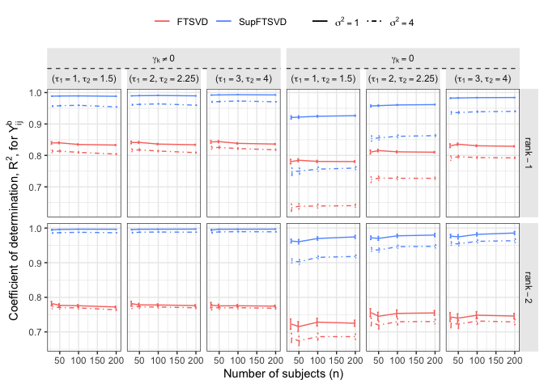

# SupFTSVD: a dimension reduction approach


# Introduction

Alam (2024+) proposed SupFTSVD as a supervised low-rank approximation of
high-dimensional multivariate functional data via tensor decomposition.
This repository highlights results of the simulation study.

``` r
library(tidyverse)
library(dplyr)
library(gridExtra)
library(ggplot2)
library(factoextra)
library(glmnet)
library(rsvd)
library(ggpubr)
library(matrixcalc)
library(ggh4x)
source(paste(getwd(),'/SimulationStudy_RCodes/FTSVD.R',sep = ""))
```

``` r
dirP<-paste(getwd(),"/SimulationStudy_Results/",sep="")
fname<-list.files(dirP)
mbar<-c(3,5,8)
```

``` r
Res2g3<-read.csv(paste(dirP,fname[5],sep = ""))
Res3g3<-read.csv(paste(dirP,fname[6],sep = ""))
Res2g3us<-read.csv(paste(dirP,fname[11],sep = ""))
Res3g3us<-read.csv(paste(dirP,fname[12],sep = ""))
```

``` r
Res2_dat<-Res2g3 %>%
  mutate(SNR=ifelse(Sig2E==1,"paste(SNR[1])",ifelse(Sig2E==2,"paste(SNR[2])","paste(SNR[3])")),
         xiFTSVD1=sqrt(xiFTSVD1),
         xiSupFTSVD1=sqrt(xiSupFTSVD1)) %>%
  dplyr::select(Tau,n,comp,Grid,SNR,Tau,FTSVD1MP,bFTSVD1,xiFTSVD1,SupFTSVD1CM,bSupFTSVD1,xiSupFTSVD1,FTSVD1,SupFTSVD1,Cov2R,SupCov2R,AR2_FTSVD1,AR2_SupFTSVD1) %>%
  set_names("Tau","n","Comp","Grid","SNR","a_FTSVD","b_FTSVD","c_FTSVD","a_SupFTSVD","b_SupFTSVD","c_SupFTSVD","d_FTSVD","d_SupFTSVD","e_FTSVD","e_SupFTSVD","f_FTSVD","f_SupFTSVD") %>%
  pivot_longer(cols = ends_with("FTSVD"),names_to = c("Var",".value"),
               names_sep = "_") %>% 
  pivot_longer(cols=c("FTSVD","SupFTSVD"),values_to = "FuncV",names_to = "Method") %>%
  mutate(SamT=factor(ifelse(Tau==1,"paste(sigma^2==1)","paste(sigma^2==4)"),
                   levels=c("paste(sigma^2==1)","paste(sigma^2==4)")),
         Model="1")
```

``` r
Res2_dat_us<-Res2g3us %>%
  mutate(SNR=ifelse(Sig2E==1,"paste(SNR[1])",ifelse(Sig2E==2,"paste(SNR[2])","paste(SNR[3])")),
         xiFTSVD1=sqrt(xiFTSVD1),
         xiSupFTSVD1=sqrt(xiSupFTSVD1)) %>%
  dplyr::select(Tau,n,comp,Grid,SNR,Tau,FTSVD1MP,bFTSVD1,xiFTSVD1,SupFTSVD1CM,bSupFTSVD1,xiSupFTSVD1,FTSVD1,SupFTSVD1,Cov2R,SupCov2R,AR2_FTSVD1,AR2_SupFTSVD1) %>%
  set_names("Tau","n","Comp","Grid","SNR","a_FTSVD","b_FTSVD","c_FTSVD","a_SupFTSVD","b_SupFTSVD","c_SupFTSVD","d_FTSVD","d_SupFTSVD","e_FTSVD","e_SupFTSVD","f_FTSVD","f_SupFTSVD") %>%
  pivot_longer(cols = ends_with("FTSVD"),names_to = c("Var",".value"),
               names_sep = "_") %>% 
  pivot_longer(cols=c("FTSVD","SupFTSVD"),values_to = "FuncV",names_to = "Method") %>%
  mutate(SamT=factor(ifelse(Tau==1,"paste(sigma^2==1)","paste(sigma^2==4)"),
                   levels=c("paste(sigma^2==1)","paste(sigma^2==4)")),
         Model="1")
```

``` r
Res3_dat<-Res3g3 %>%
  mutate(SNR=ifelse(Sig2E==1|Sig2E==1.5,1,ifelse(Sig2E==2|Sig2E==2.25,2,3))) %>%
  mutate(xiFTSVD1=sqrt(xiFTSVD1),
         xiSupFTSVD1=sqrt(xiSupFTSVD1)) %>%
  dplyr::select(Tau,n,comp,Grid,SNR,Tau,FTSVD1MP,bFTSVD1,xiFTSVD1,SupFTSVD1CM,bSupFTSVD1,xiSupFTSVD1,FTSVD1,SupFTSVD1,Cov2R,SupCov2R,AR2_FTSVD1,AR2_SupFTSVD1) %>%
  set_names("Tau","n","Comp","Grid","SNR","a_FTSVD","b_FTSVD","c_FTSVD","a_SupFTSVD","b_SupFTSVD","c_SupFTSVD","d_FTSVD","d_SupFTSVD","e_FTSVD","e_SupFTSVD","f_FTSVD","f_SupFTSVD") %>%
  pivot_longer(cols = ends_with("FTSVD"),names_to = c("Var",".value"),
               names_sep = "_") %>%
  pivot_longer(c("FTSVD","SupFTSVD"),names_to = "Method",values_to = "FuncV") %>%
  mutate(SNR=recode(SNR,
                    "1"="paste(SNR[1])",
                    "2"="paste(SNR[2])",
                    "3"="paste(SNR[3])"),
         SamT=factor(ifelse(Tau==1,"paste(sigma^2==1)","paste(sigma^2==4)"),levels=c("paste(sigma^2==1)","paste(sigma^2==4)")),
         Model="2")
```

``` r
Res3_dat_us<-Res3g3us %>%
  mutate(SNR=ifelse(Sig2E==1|Sig2E==1.5,1,ifelse(Sig2E==2|Sig2E==2.25,2,3))) %>%
  mutate(xiFTSVD1=sqrt(xiFTSVD1),
         xiSupFTSVD1=sqrt(xiSupFTSVD1)) %>%
  dplyr::select(Tau,n,comp,Grid,SNR,Tau,FTSVD1MP,bFTSVD1,xiFTSVD1,SupFTSVD1CM,bSupFTSVD1,xiSupFTSVD1,FTSVD1,SupFTSVD1,Cov2R,SupCov2R,AR2_FTSVD1,AR2_SupFTSVD1) %>%
  set_names("Tau","n","Comp","Grid","SNR","a_FTSVD","b_FTSVD","c_FTSVD","a_SupFTSVD","b_SupFTSVD","c_SupFTSVD","d_FTSVD","d_SupFTSVD","e_FTSVD","e_SupFTSVD","f_FTSVD","f_SupFTSVD") %>%
  pivot_longer(cols = ends_with("FTSVD"),names_to = c("Var",".value"),
               names_sep = "_") %>%
  pivot_longer(c("FTSVD","SupFTSVD"),names_to = "Method",values_to = "FuncV") %>%
  mutate(SNR=recode(SNR,
                    "1"="paste(SNR[1])",
                    "2"="paste(SNR[2])",
                    "3"="paste(SNR[3])"),
         SamT=factor(ifelse(Tau==1,"paste(sigma^2==1)","paste(sigma^2==4)"),levels=c("paste(sigma^2==1)","paste(sigma^2==4)")),
         Model="2")
```

## $R^2$ for data model

``` r
Res2_dat %>%
  add_case(Res3_dat) %>%
  add_case(Res2_dat_us) %>%
  add_case(Res3_dat_us) %>%
  mutate(Scenario=rep(c("Sup","USup"),c(nrow(Res2_dat)+nrow(Res3_dat),nrow(Res2_dat_us)+nrow(Res3_dat_us)))) %>%
  group_by(Tau,n,Comp,Method,Model,SNR,Var,Scenario) %>%
  mutate(Iter=row_number()) %>%
  ungroup() %>%
  mutate(ModelCompTau=paste("paste(sigma^2==",Tau,"~","(list(k==",Comp,",r==",Model,")))",sep=""))%>%
  mutate(ModelTau=factor(paste("paste(sigma^2==",Tau,"~","(r==",Model,"))",sep=""),labels = c("paste(sigma^2==1(r==1))","paste(sigma^2==4(r==1))","paste(sigma^2==1(r==2))","paste(sigma^2==4(r==2))")))%>%
  mutate(ModelComp=factor(ifelse(Model=="1" & Comp=="1","paste(list(k==1,r==1))",
                                 ifelse(Model=="2" & Comp=="1","paste(list(k==1,r==2))","paste(list(k==2,r==2))")),labels = c(expression("("*list(k==1,r==1)*")"), expression("("*list(k==1,r==2)*")"),expression("("*list(k==2,r==2)*")")))) %>%
  mutate(TauSNR=paste("paste(sigma^2==",Tau,"~","(",SNR,"))",sep="")) %>%
  filter(Var=="f") %>%
  filter(!(Model==2 & Comp==1)) %>%
  mutate(Model=recode(Model,
                      "1"="rank-1",
                      "2"="rank-2")) %>%
  group_by(Model,Tau,SNR,n,Scenario,Method) %>%
  summarise_if(is.numeric,c("mean","sd","length")) %>%
  mutate(Scenario=ifelse(Scenario=="Sup","paste(bold(beta)[k]!=0)","paste(bold(beta)[k]==0)")) %>%
  ggplot(aes(x=n,y=FuncV_mean,group=interaction(Method,Tau),color=Method)) +
  geom_line(aes(linetype=as.factor(Tau))) +
  geom_errorbar(aes(ymin=FuncV_mean-2*(FuncV_sd/sqrt(FuncV_length)),ymax=FuncV_mean+2*(FuncV_sd/sqrt(FuncV_length)),linetype=as.factor(Tau)),
                position=position_dodge(5)) +
  facet_nested(Model~Scenario+SNR,scales = "free_y",labeller = label_parsed,nest_line = element_line(linetype = 2)) + 
  #facet_grid(rows = vars(Model),cols = vars(Scenario,SNR),scales = "free_y",labeller = label_parsed)+
  xlab(expression("Number of subjects (n)")) +
  ylab(expression("Coefficient of determination, "*R^2*", for "*Y[ij]^b)) +
  theme(legend.title = element_blank(),
        legend.position = "top",
        legend.background = element_rect(fill = "transparent",linetype = 0),
        legend.direction = "horizontal",
        legend.box = "horizontal",
        panel.background = element_rect(fill = "white",colour = NA), 
        panel.border = element_rect(fill = NA, colour = "grey20"), 
        panel.grid = element_line(colour = "grey92"), 
        panel.grid.minor = element_line(linewidth = rel(0.5)), 
        strip.background = element_rect(fill = "grey92", 
                                        colour = "grey92"), complete = TRUE)+
  scale_color_manual(values=c("#F8766D","#619CFF")) +
  scale_linetype_manual(values=c(1,4),labels=c(expression(sigma^2==1),expression(sigma^2==4)))
```



## $R^2$ for subject model

``` r
Res2_dat %>%
  add_case(Res3_dat) %>%
  add_case(Res2_dat_us) %>%
  add_case(Res3_dat_us) %>%
  mutate(Scenario=rep(c("Sup","USup"),c(nrow(Res2_dat)+nrow(Res3_dat),nrow(Res2_dat_us)+nrow(Res3_dat_us)))) %>%
  group_by(Tau,n,Comp,Method,Model,SNR,Var,Scenario) %>%
  mutate(Iter=row_number()) %>%
  ungroup() %>%
  mutate(ModelCompTau=paste("paste(sigma^2==",Tau,"~","(list(k==",Comp,",r==",Model,")))",sep=""))%>%
  mutate(ModelComp=factor(ifelse(Model=="1" & Comp=="1","paste(list(k==1,r==1))",
                         ifelse(Model=="2" & Comp=="1","paste(list(k==1,r==2))","paste(list(k==2,r==2))")),labels = c(expression("("*list(k==1,r==1)*")"), expression("("*list(k==1,r==2)*")"),expression("("*list(k==2,r==2)*")")))) %>%
  mutate(TauSNR=paste("paste(sigma^2==",Tau,"~","(",SNR,"))",sep="")) %>%
  filter(Var=="e") %>%
  group_by(ModelComp,Tau,SNR,n,Scenario,Method) %>%
  summarise_if(is.numeric,c("mean","sd","length")) %>%
  mutate(Scenario=ifelse(Scenario=="Sup","paste(bold(beta)[k]!=0)","paste(bold(beta)[k]==0)")) %>%
  ggplot(aes(x=n,y=FuncV_mean,group=interaction(Method,Tau),color=Method)) +
  geom_line(aes(linetype=as.factor(Tau))) +
  geom_errorbar(aes(ymin=FuncV_mean-2*(FuncV_sd/sqrt(FuncV_length)),ymax=FuncV_mean+2*(FuncV_sd/sqrt(FuncV_length)),linetype=as.factor(Tau)),
                position=position_dodge(5)) +
  facet_nested(ModelComp~Scenario+SNR,scales = "free_y",labeller = label_parsed,nest_line = element_line(linetype = 2)) + 
  xlab(expression("Number of subjects (n)")) +
  ylab(expression("Coefficient of determination, "*R^2*", for "*zeta[ik])) +
  theme(legend.title = element_blank(),
        legend.position = "top",
        legend.background = element_rect(fill = "transparent",linetype = 0),
        legend.direction = "horizontal",
        legend.box = "horizontal",
        panel.background = element_rect(fill = "white",colour = NA), 
        panel.border = element_rect(fill = NA, colour = "grey20"), 
        panel.grid = element_line(colour = "grey92"), 
        panel.grid.minor = element_line(linewidth = rel(0.5)), 
        strip.background = element_rect(fill = "grey92", 
                                        colour = "grey92"), complete = TRUE)+
  scale_color_manual(values=c("#F8766D","#619CFF")) +
  scale_linetype_manual(values=c(1,4),labels=c(expression(sigma^2==1),expression(sigma^2==4)))
```


